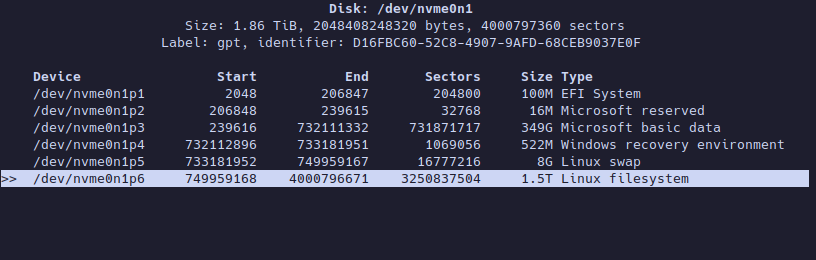
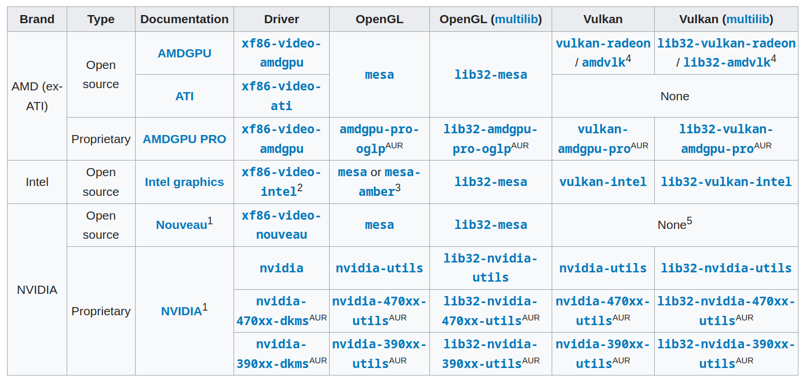

# Minimal setup Arch Linux Dual Boot Windows with KDE Plasma

Arch ISO Image build as of: 2023.11.01
Included Kernel: 6.5.9
ISO Size: 807.3 MB

## Table Of Contents
⚠️Work in progress⚠️

## Install Windows

Download Windows using the Media Creation Tool from the official website and proceed with the installation.

## Download Arch Linux

Download [Arch Linux](https://archlinux.org/download/) from the official website.

# Install Arch Linux

Prepare an installation medium and boot the live environment.

## Set the console keyboard layout and font

To check existing keymaps:

```bash
localectl list-keymaps
```

Set intresting keymaps:

```bash
loadkeys [keymap]
```

## Connect to the internet

Ethernet - plug in the cable

WiFi - use iwctl

```bash
ping -c 4 8.8.8.8
```

## Update the system clock

```bash
timedatectl set-ntp true
```

## Patrition the disks (UEFI)

Search for disks to partition by running:

```bash
fdisk -l
```

Open the program to partition the disk:

```bash
cfdisk [disk_to_patrition]
```

Create a Linux filesystem for swap, 4-8 GB maximum or more if you intend to use the hibernate option.

Create a Linux filesystem as per your preference.

Change the type of the Linux filesystem partition intended for swap to "swap."

Remember the devices for EFI System, Linux swap, and Linux filesystem.

Remember what device is EFI System, Linux swap, Linux filesystem

For example:


## Format the partitions

```bash
mkfs.ext4 [patrition_with_linux_filesystem]
```

```bash
mkswap <patrition_with_swap>
```

```bash
swapon <patrition_with_swap>
```

## Mount the file systems

```bash
mount <patrition_with_linux_filesystem> /mnt
```

```bash
mkdir /mnt/efi
```

```bash
mount <patrition_with_windows_efi> /mnt/efi
```
## Install esssentail packages

```bash
pacstrap /mnt base base-devel linux linux-firmware linux-headers nano amd-ucode
```

Replace `nano` with editor of your choice (i.e `vim` ).
Replace `intel-ucode` with `amd-ucode` if you are using an AMD processor.


## Fstab

```bash
genfstab -U /mnt >> /mnt/etc/fstab
```

## Chroot

```bash
arch-chroot /mnt
```

## Time

```bash
ln -sf /usr/share/zoneinfo/[Region]/[City] /etc/localtime
```

```bash
hwclock --systohc
```

Replace [Region] & [City] according to your Time zone

## Localization

```bash
nano /etc/locale.gen
```

Uncomment:
```plaintext
en_US.UTF-8 UTF-8
```

```bash
locale-gen
```

```bash
echo LANG=en_US.UTF-8 > /etc/locale.conf
```

## Network configuration

### Set hostname

```bash
echo [username] > /etc/hostname
```

### Set hosts

```bash
nano /etc/hosts
```

```plaintext
127.0.0.1    localhost
::1          localhost
127.0.1.1    [username].localdomain arch
```

### Network Manager

```bash
pacman -S networkmanager
```

```bash
systemctl enable NetworkManager
```

## Add user

```bash
useradd -G wheel,audio,video -m [username]
```

## Change passwords

For root user:

```bash
passwd
```

For created user:

```bash
passwd [user]
```

## Bootloader

```bash
pacman -S grub  efibootmgr os-prober
```

```bash
grub-install --target=x86_64-efi --efi-directory=/efi/ --bootloader-id=GRUB
```

```bash
nano /etc/default/grub
```

Uncomment:
```plaintext
GRUB_DISABLE_OS_PROBER=false
```

```bash
grub-mkconfig -o /boot/grub/grub.cfg
```

## Enable sudo

```bash
pacman -S sudo
```

```bash
nano /etc/sudoers
```

Uncomment
```plaintext
%wheel ALL=(ALL) ALL
```

## Reboot

Simply reboot

```bash
reboot
```

# Setup Desktop Enviroment

## Enable multilib repo

```bash
nano /etc/pacman.conf
```

Uncomment:
```plaintext
#[multilib]
Include = /etc/pacman.d/mirrorlist
```

## install xorg and gpu drivers

```bash
sudo pacman -S xorg <gpu-drivers-packages>
```

For Nvidia GPUs:
For newer AMD GPUs:
For legacy Radeon GPUs like HD 7xxx Series & below:
For dedicated Intel Graphics:

More information:


## Install sddm

```bash
sudo pacman -S sddm
```

```bash
sudo systemctl enable sddm
```

## Install plasma

```bash
sudo pacman -S plasma-desktop konsole dolphin ark spectacle partitionmanager packagekit-qt5 plasma-nm kdeplasma-addons kde-gtk-config breeze-gtk kscreen
```

## Audio utilites

```bash
sudo pacman -S pulseaudio pulseaudio-alsa plasma-pa
```

## Bluetooth utilities

```bash
sudo pacman -S bluez bluez-utils pulseaudio-bluetooth
```

```bash
sudo systemctl enable bluetooth.service
```

# My apps

## Official repo packages

```bash
sudo pacman -S  wget screen git neofetch discord obsidian mpv vlc okular kate ttf-dejavu adobe-source-sans-pro-font ttf-liberation
```

## AUR

```bash
git clone https://aur.archlinux.org/yay.git
```

```bash
cd yay
```

```bash
makepkg -si
```

## Aur packages

```bash
yay -S visual-studio-code-bin brave
```

## Customization

### Catppuccin (Mocha)

#### KDE Theme

```bash
git clone --depth=1 https://github.com/catppuccin/kde catppuccin-kde && cd catppuccin-kde
```
Run the install script using ./install.sh and follow the instructions.\

#### GRUB

```bash
git clone https://github.com/catppuccin/grub.git && cd grub
```

```bash
sudo cp -r src/* /usr/share/grub/themes/
```

```bash
nano /etc/default/grub
```

Change `GRUB_THEME` to:

```plaintext
GRUB_THEME="/usr/share/grub/themes/catppuccin-mocha-grub-theme/theme.txt"
```

```bash
sudo grub-mkconfig -o /boot/grub/grub.cfg
```

#### VS Code

Check in vscode marketplace: Catppuccin for VSCode

Change editor to git in vs terminal:

```bash
git config --global core.editor [name_of_editor]
```

#### Console

```bash
git clone https://github.com/catppuccin/konsole.git
```

Copy flavour.colorscheme to the user konsole directory (usually ~/.local/share/konsole/)

- Reload Konsole
- Navigate to Settings > Manage Profiles, then click New
- Check Default Profile
- Open the Appearence tab and select Catppuccin
- Click Apply, then OK

## Reboot

```bash
sudo reboot
```

# Changelog

## 2023.11.23
- Created guide
